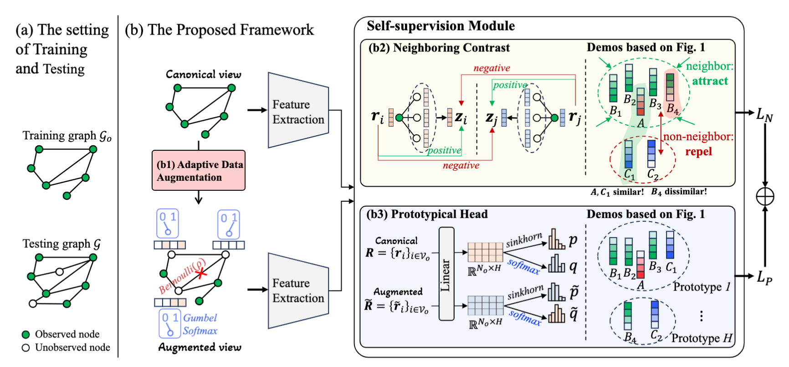

### Implmentation code for "Non-Neighbors Also Matter to Kriging: A New Contrastive-Prototypical Learning" accepted by AISTATS2024




#### Requirements:

```bash
numpy==1.23.3
pandas==1.4.4
PyYAML==6.0
scikit_learn==1.1.3
torch==1.9.1
torch_geometric==2.1.0.post1
```


#### Usage

- Choose the dataset from config yaml
- Pretraining: 

  ```bash 
  python trains.py
  ```

- Downstream finetuing and evaluation:

  ```bash
  python models/ds_model_2stage.py
  ```

#### Citation

```bibtex
@article{li2024non,
  title={Non-Neighbors Also Matter to Kriging: A New Contrastive-Prototypical Learning},
  author={Li, Zhishuai and Nie, Yunhao and Li, Ziyue and Bai, Lei and Lv, Yisheng and Zhao, Rui},
  journal={arXiv preprint arXiv:2401.12681},
  year={2024}
}
```


